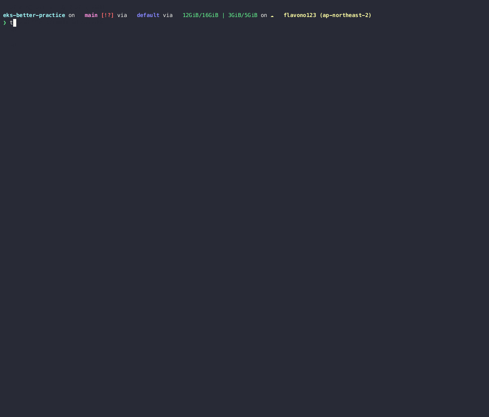

# `terraform plan -summary`



*Summarize resource addresses from a `terraform plan` result*

## Prerequisites

- [`terraform`](https://developer.hashicorp.com/terraform/tutorials/aws-get-started/install-cli)
- [`jq`](https://jqlang.github.io/jq/download/)

### MacOS

```sh
brew install terraform jq
# or install terraform by `tfenv`
```

## Install

```sh
wget -qO $HOME/.terraform.d/terraform-plan-summary https://raw.githubusercontent.com/flavono123/terraform-plan-summary/main/terraform-plan-summary && \
  chmod +x $HOME/.terraform.d/terraform-plan-summary && \
  echo "alias terraform='$HOME/.terraform.d/terraform-plan-summary'" >> $HOME/.bashrc
```

## References

[Show only the resources that will be changed in terraform plan - trying to use jq for this](https://www.reddit.com/r/Terraform/comments/10m7jdd/show_only_the_resources_that_will_be_changed_in/)
